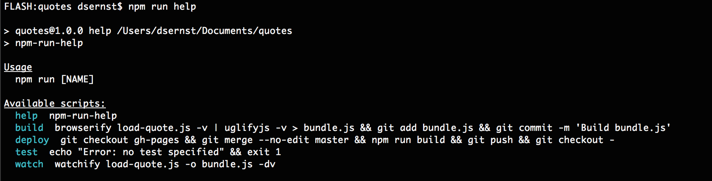

# npm-run-help

List the [`npm run` scripts](https://docs.npmjs.com/cli/run-script) available.

## Install

First download:

`npm i --save-dev npm-run-help`

Then add to your `package.json`'s scripts field:

```diff
"scripts": {
+  "help": "npm-run-help",
  "build": "browserify load-quote.js -v | uglifyjs -v > bundle.js && git add bundle.js && git commit -m 'Build bundle.js'",
  "deploy": "git checkout gh-pages && git merge --no-edit master && npm run build && git push && git checkout -",
  "test": "echo \"Error: no test specified\" && exit 1",
  "watch": "watchify load-quote.js -o bundle.js -dv"
},
```


## Usage

Now that it's installed, run:

```
npm run help
```

to see your available [`run-scripts`](https://docs.npmjs.com/cli/run-script).



## Global install

An alternative is to globally install the package to your machine:

`npm i --global npm-run-help`

Then you can use it in any repo immediately with:

`npm-run-help` (note the hyphens)
